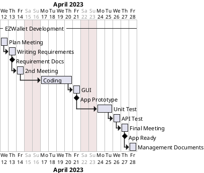

# Project Estimation - FUTURE

Date: 26/04/2023

Version: 1

# Estimation approach

Consider the EZWallet project in FUTURE version (as proposed by the team), assume that you are going to develop the project INDEPENDENT of the deadlines of the course

# Estimate by size

###

|                                                                                                         | Estimate            |
| ------------------------------------------------------------------------------------------------------- | ------------------- |
| NC = Estimated number of classes to be developed                                                        | 7                   |
| A = Estimated average size per class, in LOC                                                            | 400                 |
| S = Estimated size of project, in LOC (= NC \* A)                                                       | 2800                |
| E = Estimated effort, in person hours (here use productivity 10 LOC per person hour)                    | 280                 |
| C = Estimated cost, in euro (here use 1 person hour cost = 30 euro)                                     | 8400                |
| Estimated calendar time, in calendar weeks (Assume team of 4 people, 8 hours per day, 5 days per week ) | 9 days -> 1,8 weeks |

# Estimate by product decomposition

| component name       | Estimated effort (person hours) |
| -------------------- | ------------------------------- |
| requirement document | 20                              |
| GUI prototype        | 16                              |
| design document      | 8                               |
| code                 | 100                             |
| unit tests           | 60                              |
| api tests            | 15                              |
| management documents | 3                               |

# Estimate by activity decomposition

| Activity name        | Estimated effort (person hours) |
| -------------------- | ------------------------------- |
| Plan Meeting         | 5                               |
| Writing Requirements | 25                              |
| 2nd Meeting          | 5                               |
| Coding               | 100                             |
| GUI                  | 20                              |
| Unit Test            | 60                              |
| API Test             | 15                              |
| Management Documents | 3                               |
| Final Meeting        | 5                               |

## Gantt Diagram

Made starting from the acrivity decomposition, considering 4 people working 8 hours a day on 5 days a week.

# Summary

There are two main causes of the difference between estimated duration by product and activity decomposition: activity decomposition include activities like meeting for planning what you have to do and more specifically include also days in which people don't work like sundays so is more a calendar while product decompisition is only the sum of the hour of what you have to do divided by people who work and by person hours of everyone.

|                                    | Estimated effort | Estimated duration |
| ---------------------------------- | ---------------- | ------------------ |
| estimate by size                   | 280              | 10 days            |
| estimate by product decomposition  | 222              | 8 days             |
| estimate by activity decomposition | 236              | 16 days            |

Made considering 4 people working 8 hours a day on 5 days a week.
