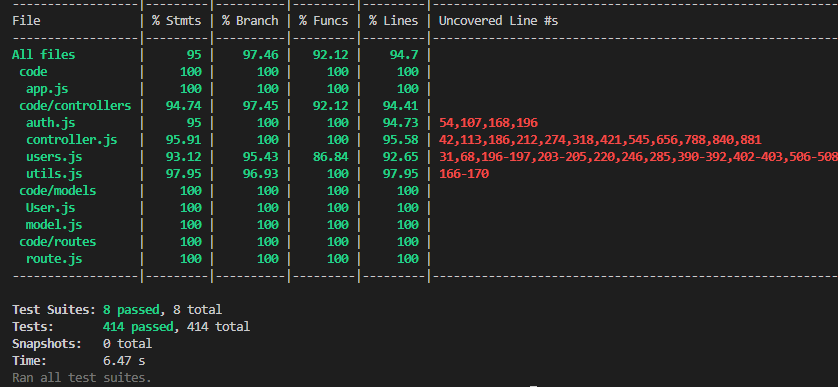

# Test Report

The goal of this document is to explain how the application was tested, detailing how the test cases were defined and what they cover

# Contents

- [Dependency graph](#dependency-graph)

- [Integration approach](#integration-approach)

- [Tests](#tests)

- [Coverage](#Coverage)

# Dependency graph

```plantuml

package "Controllers" {
    [auth.js] as auth
    [controller.js] as controller
    [users.js] as users
    [utils.js] as utils
}

package "Routes" {
    [route.js] as route
}

package "Models" {
    [model.js] as model
    [User.js] as user
}

package "External Libraries" {
    [bcrypt] as bcrypt
    [jwt] as jwt
    [mongoose] as mongoose
}

route ..> controller : "Uses" 
route ..> users : "Uses" 
route ..> auth : "Uses" 

controller ..> utils : "Uses" 
users ..> utils : "Uses" 
controller ..> user : "Uses" 
users ..> user : "Uses" 
controller ...> model : "Uses" 
users ...> model : "Uses" 
auth ..> user : "Uses" 
auth ..> bcrypt : "Uses" 
users ..> mongoose : "Uses" 
controller ..> mongoose : "Uses" 
auth ..> jwt : "Uses" 
utils ..> jwt : "Uses" 
```

# Integration approach

It was adopted a mixed approach. This gave us the benefits of both top-down and bottom up and reduce the drawbacks.

Example: step 1: unit A, step 2: integration A, step 3: unit B, step 4: integration B, step 5: unit A+B, step 6: integration A+B; where A represents a low level component while B is an high level one. We tested each component as a unit and after as integration. In the end the two components's interaction can be tested in unit and after with integration.

# Tests

| Test case name | Object(s) tested | Test level | Technique used |
| -------------- | ---------------- | ---------- | -------------- |
| return empty object if no params specified | handleDateFilterParams | Unit | WB - Statement Coverage |
 | return error if params date is present with upTo | handleDateFilterParams | Unit | WB - Statement Coverage |
 | return error if params date is present with from | handleDateFilterParams | Unit | WB - Statement Coverage |
 | return error if from and upTo are present but from is NAN | handleDateFilterParams | Unit | WB - Statement Coverage |
 | return error if from and upTo are present but upTo is NAN | handleDateFilterParams | Unit | WB - Statement Coverage |
 | return error if from and upTo are present but from is greather than upTo | handleDateFilterParams | Unit | WB - Statement Coverage |
 | return interval dates object if from and upTo are present and not NAN | handleDateFilterParams | Unit | WB - Statement Coverage |
 | return error if there is only from and is NAN | handleDateFilterParams | Unit | WB - Statement Coverage |
 | return gte object if there is only from and not NAN | handleDateFilterParams | Unit | WB - Statement Coverage |
 | return error if there is only upTo and is NAN | handleDateFilterParams | Unit | WB - Statement Coverage |
 | return lte object if there is only upTo and not NAN | handleDateFilterParams | Unit | WB - Statement Coverage |
 | return error if there is only date and is NAN | handleDateFilterParams | Unit | WB - Statement Coverage |
 | return interval dates object if there is only date and not NAN | handleDateFilterParams | Unit | WB - Statement Coverage |
 | return error if accessToken is missing | verifyAuth | Unit | WB - Statement Coverage |
 | return error if refreshToken is missing | verifyAuth | Unit | WB - Statement Coverage |
 | return error if decodedAccessToken is missing (username) | verifyAuth | Unit | WB - Statement Coverage |
 | return error if decodedAccessToken is missing (email) | verifyAuth | Unit | WB - Statement Coverage |
 | return error if decodedAccessToken is missing (role) | verifyAuth | Unit | WB - Statement Coverage |
 | return error if decodedRefreshToken is missing (username) | verifyAuth | Unit | WB - Statement Coverage |
 | return error if decodedRefreshToken is missing (email) | verifyAuth | Unit | WB - Statement Coverage |
 | return error if decodedRefreshToken is missing (role) | verifyAuth | Unit | WB - Statement Coverage |
 | return error if decodedRefreshToken is different from decodedAccessToken (username) | verifyAuth | Unit | WB - Statement Coverage |
 | return error if decodedRefreshToken is different from decodedAccessToken (email) | verifyAuth | Unit | WB - Statement Coverage |
 | return error if decodedRefreshToken is different from decodedAccessToken (role) | verifyAuth | Unit | WB - Statement Coverage |
 | return error if decodedRefreshToken.role is different from info.authtype and info.authtype not group | verifyAuth | Unit | WB - Statement Coverage |
 | return error if decodedRefreshToken.email is different from info.email | verifyAuth | Unit | WB - Statement Coverage |
 | return error if decodedRefreshToken.username is different from info.username | verifyAuth | Unit | WB - Statement Coverage |
 | return error if decodedRefreshToken.email isnt in info.emailInGroup (for user who has to require for his group)  | verifyAuth | Unit | WB - Statement Coverage |
 | return email and id of decodedRefreshToken if info.authType is Group  | verifyAuth | Unit | WB - Statement Coverage |
 | return empty object if no params specified | handleAmountFilterParams | Unit | WB - Statement Coverage |
 | return error if max and min are present but max is NAN | handleAmountFilterParams | Unit | WB - Statement Coverage |
 | return error if max and min are present but min is NAN | handleAmountFilterParams | Unit | WB - Statement Coverage |
 | return error if max and min are present but min is greather than max | handleAmountFilterParams | Unit | WB - Statement Coverage |
 | return amount interval object if max and min are present and numbers | handleAmountFilterParams | Unit | WB - Statement Coverage |
 | return error if there is only min but is NAN | handleAmountFilterParams | Unit | WB - Statement Coverage |
 | return interval if there is only min and non NAN | handleAmountFilterParams | Unit | WB - Statement Coverage |
 | return error if there is only max but is NAN | handleAmountFilterParams | Unit | WB - Statement Coverage |
 | return interval if there is only max and non NAN | handleAmountFilterParams | Unit | WB - Statement Coverage |
 | should return 200 and a success message when all fields are provided correctly | register | Unit | WB - Statement Coverage |
 | should return 400 if any required field is missing (email) | register | Unit | WB - Statement Coverage |
 | should return 400 if any required field is missing (username) | register | Unit | WB - Statement Coverage |
 | should return 400 if any required field is missing (password) | register | Unit | WB - Statement Coverage |
 | should return 400 if any required field is an empty string (username) | register | Unit | WB - Statement Coverage |
 | should return 400 if any required field is an empty string (email) | register | Unit | WB - Statement Coverage |
 | should return 400 if any required field is an empty string (password) | register | Unit | WB - Statement Coverage |
 | should return 400 if the email is not in a valid format | register | Unit | WB - Statement Coverage |
 | should return 400 if the email is already registered | register | Unit | WB - Statement Coverage |
 | should return 400 if the username is already taken | register | Unit | WB - Statement Coverage |
 | should return 200 and a success message when all fields are provided correctly | registerAdmin | Unit | WB - Statement Coverage |
 | should return 400 if any required field is missing (email) | registerAdmin | Unit | WB - Statement Coverage |
 | should return 400 if any required field is missing (username) | registerAdmin | Unit | WB - Statement Coverage |
 | should return 400 if any required field is missing (password) | registerAdmin | Unit | WB - Statement Coverage |
 | should return 400 if any required field is an empty string (username) | registerAdmin | Unit | WB - Statement Coverage |
 | should return 400 if any required field is an empty string (email) | registerAdmin | Unit | WB - Statement Coverage |
 | should return 400 if any required field is an empty string (password) | registerAdmin | Unit | WB - Statement Coverage |
 | should return 400 if the email is not in a valid format | registerAdmin | Unit | WB - Statement Coverage |
 | should return 400 if the email is already registered | registerAdmin | Unit | WB - Statement Coverage |
 | should return 400 if the username is already taken | registerAdmin | Unit | WB - Statement Coverage |
 | should return 200 and tokens if login is successful | login | Unit | WB - Statement Coverage |
 | should return 400 if any required field is missing (email) | login | Unit | WB - Statement Coverage |
 | should return 400 if any required field is missing (password) | login | Unit | WB - Statement Coverage |
 | should return 400 if any required field is an empty string (email) | login | Unit | WB - Statement Coverage |
 | should return 400 if any required field is an empty string (password) | login | Unit | WB - Statement Coverage |
 | should return 400 if the email is not in a valid format | login | Unit | WB - Statement Coverage |
 | should return 400 if the email in the request body does not identify a user in the database | login | Unit | WB - Statement Coverage |
 | should return 400 if the supplied password does not match with the one in the database | login | Unit | WB - Statement Coverage |
 | should return 200 and message if logout is successful | logout | Unit | WB - Statement Coverage |
 | should return 400 error if the request does not have a refresh token in the cookies | logout | Unit | WB - Statement Coverage |
 | should return 400 error if the refresh token in the requests cookies does not represent a user in the database | logout | Unit | WB - Statement Coverage |
 | createCategory: Creates a new category and returns type and color | createCategory | Unit | WB - Statement Coverage |
 | createCategory: Returns a 400 error if the request body does not contain all the necessary attributes | createCategory | Unit | WB - Statement Coverage |
 | createCategory: Returns a 400 error if at least one of the parameters in the request body is an empty string | createCategory | Unit | WB - Statement Coverage |
 | createCategory: Returns a 400 error if the type of category passed in the request body represents an already existing category in the database | createCategory | Unit | WB - Statement Coverage |    
 | createCategory: Returns a 401 error if called by an authenticated user who is not an admin (authType = Admin) | createCategory | Unit | WB - Statement Coverage |
 | updateCategory: Returns a message for confirmation and the number of updated transactions | updateCategory | Unit | WB - Statement Coverage |
 | updateCategory: Returns a 400 error if the request body does not contain all the necessary attributes | updateCategory | Unit | WB - Statement Coverage |
 | updateCategory: Returns a 400 error if at least one of the parameters in the request body is an empty string | updateCategory | Unit | WB - Statement Coverage |
 | updateCategory: Returns a 400 error if the type of category passed as a route parameter does not represent a category in the database | updateCategory | Unit | WB - Statement Coverage |
 | updateCategory: Returns a 400 error if the type of category passed in the request body as the new type represents an already existing category in the database and that category is not the same as the requested one | updateCategory | Unit | WB - Statement Coverage |
 | updateCategory: Returns a message for confirmation and the number of updated transactions, with same category name | updateCategory | Unit | WB - Statement Coverage |
 | updateCategory: Returns a 401 error if called by an authenticated user who is not an admin (authType = Admin) | updateCategory | Unit | WB - Statement Coverage |
 | deleteCategory: Delete all the categories specified inside types, case N > T | deleteCategory | Unit | WB - Statement Coverage |
 | deleteCategory: Delete all the categories specified inside types, case N = T | deleteCategory | Unit | WB - Statement Coverage |
 | deleteCategory: Returns a 400 error if the request body does not contain all the necessary attributes | deleteCategory | Unit | WB - Statement Coverage |
 | deleteCategory: Returns a 400 error if called when there is only one category in the database | deleteCategory | Unit | WB - Statement Coverage |
 | deleteCategory: Returns a 400 error if at least one of the types in the array is an empty string | deleteCategory | Unit | WB - Statement Coverage |
 | deleteCategory: Returns a 400 error if the array passed in the request body is empty | deleteCategory | Unit | WB - Statement Coverage |
 | deleteCategory: Returns a 400 error if at least one of the types in the array does not represent a category in the database | deleteCategory | Unit | WB - Statement Coverage |
 | deleteCategory: Returns a 400 error if at least one of the types in the array does not represent a category in the database | deleteCategory | Unit | WB - Statement Coverage |
 | getCategories: Get all the categories by returning an array of objects, each one having attributes type and color | getCategories | Unit | WB - Statement Coverage |
 | getCategories: Returns a 401 error if called by a user who is not authenticated (authType = Simple) | getCategories | Unit | WB - Statement Coverage |
 | createTransaction: return 200 and response: (username, type, amount and date) | createTransaction | Unit | WB - Statement Coverage |
 | createTransaction: Returns a 400 error if request body does not contain all necessary attributes | createTransaction | Unit | WB - Statement Coverage |
 | createTransaction: Returns a 400 error if at least one parameter in request body is an empty string | createTransaction | Unit | WB - Statement Coverage |
 | createTransaction: Returns a 400 error if the type of category passed in the request body does not represent a category in the database | createTransaction | Unit | WB - Statement Coverage |        
 | createTransaction: Returns a 400 error if the username passed in the request body is not equal to the one passed as a route parameter | createTransaction | Unit | WB - Statement Coverage |
 | createTransaction: Returns a 400 error if the username passed in the request body does not represent a user in the database | createTransaction | Unit | WB - Statement Coverage |
 | createTransaction: Returns a 400 error if the username passed as a route parameter does not represent a user in the database | createTransaction | Unit | WB - Statement Coverage |
 | createTransaction: Returns a 400 error if the amount passed in the request body cannot be parsed as a floating value (negative numbers are accepted) | createTransaction | Unit | WB - Statement Coverage |
 | createTransaction: Returns a 401 error if called by an authenticated user who is not the same user as the one in the route parameter (authType = User) | createTransaction | Unit | WB - Statement Coverage |
 | getAllTransactions: return 200 and json with all transaction | getAllTransactions | Unit | WB - Statement Coverage |
 | getAllTransactions: Returns a 401 error if called by an authenticated user who is not an admin (authType = Admin) | getAllTransactions | Unit | WB - Statement Coverage |
 | getTransactionsByUser: return 200 and json with all transaction | getTransactionsByUser | Unit | WB - Statement Coverage |
 | getTransactionsByUser: Returns a 400 error if the username passed as a route parameter does not represent a user in the database | getTransactionsByUser | Unit | WB - Statement Coverage |
 | getTransactionsByUser:  Returns a 401 error if called by an authenticated user who is not the same user as the one in the route (authType = User) if the route is /api/users/:username/transactions | getTransactionsByUser | Unit | WB - Statement Coverage |
 | Returns a 401 error if called by an authenticated user who is not an admin (authType = Admin) if the route is /api/transactions/users/:username | getTransactionsByUser | Unit | WB - Statement Coverage |
 | getTransactionsByUserByCategory: return 200 and json with all transaction | getTransactionsByUserByCategory | Unit | WB - Statement Coverage |
 | getTransactionsByUserByCategory: Returns a 400 error if the username passed as a route parameter does not represent a user in the database | getTransactionsByUserByCategory | Unit | WB - Statement Coverage |
 | getTransactionsByUserByCategory: Returns a 400 error if the category passed as a route parameter does not represent a category in the database | getTransactionsByUserByCategory | Unit | WB - Statement Coverage |
 | getTransactionsByUserByCategory: Returns a 401 error if called by an authenticated user who is not the same user as the one in the route (authType = User) if the route is /api/users/:username/transactions/category/:category | getTransactionsByUserByCategory | Unit | WB - Statement Coverage |
 | getTransactionsByUserByCategory: Returns a 401 error if called by an authenticated user who is not an admin (authType = Admin) if the route is /api/transactions/users/:username/category/:category | getTransactionsByUserByCategory | Unit | WB - Statement Coverage |
 | getTransactionsByGroup: return 200 and json with all transaction | getTransactionsByGroup | Unit | WB - Statement Coverage |
 | getTransactionsByGroup: Returns a 400 error if the group name passed as a route parameter does not represent a group in the database | getTransactionsByGroup | Unit | WB - Statement Coverage |      
 | getTransactionsByGroup: Returns a 401 error if called by an authenticated user who is not part of the group (authType = Group) if the route is /api/groups/:name/transactions | getTransactionsByGroup | Unit | WB - Statement Coverage |
 | getTransactionsByGroup: Returns a 401 error if called by an authenticated user who is not an admin (authType = Admin) if the route is /api/transactions/groups/:name | getTransactionsByGroup | Unit | WB - Statement Coverage |
 | getTransactionsByGroup: return 200 and json with all transaction | getTransactionsByGroupByCategory | Unit | WB - Statement Coverage |
 | getTransactionsByGroupByCategory: Returns a 400 error if the group name passed as a route parameter does not represent a group in the database | getTransactionsByGroupByCategory | Unit | WB - Statement Coverage |
 | getTransactionsByGroupByCategory: Returns a 400 error if the category passed as a route parameter does not represent a category in the database | getTransactionsByGroupByCategory | Unit | WB - Statement Coverage |
 | getTransactionsByGroupByCategory: Returns a 401 error if called by an authenticated user who is not part of the group (authType = Group) if the route is /api/groups/:name/transactions/category/:category | getTransactionsByGroupByCategory | Unit | WB - Statement Coverage |
 | getTransactionsByGroupByCategory: Returns a 401 error if called by an authenticated user who is not an admin (authType = Admin) if the route is /api/transactions/groups/:name/category/:category | getTransactionsByGroupByCategory | Unit | WB - Statement Coverage |
 | deleteTransaction: status 200 and transaction deleted  | deleteTransaction | Unit | WB - Statement Coverage |
 | deleteTransaction: Returns a 400 error if the request body does not contain all the necessary attributes | deleteTransaction | Unit | WB - Statement Coverage |
 | deleteTransaction: Returns a 400 error if the `_id` in the request body is an empty string | deleteTransaction | Unit | WB - Statement Coverage |
 | deleteTransaction: Returns a 400 error if the username passed as a route parameter does not represent a user in the database | deleteTransaction | Unit | WB - Statement Coverage |
 | deleteTransaction: Returns a 400 error if the `_id` in the request body does not represent a transaction in the database | deleteTransaction | Unit | WB - Statement Coverage |
 | deleteTransaction: [ADMIN] Returns a 400 error if the `_id` in the request body represents a transaction made by a different user than the one in the route | deleteTransaction | Unit | WB - Statement Coverage |
 | deleteTransaction: Returns a 401 error if called by an authenticated user who is not the same user as the one in the route (authType = User) | deleteTransaction | Unit | WB - Statement Coverage |   
 | deleteTransactions: Return status 200 and deleted transactions | deleteTransactions | Unit | WB - Statement Coverage |
 | deleteTransactions: Returns a 400 error if the request body does not contain all the necessary attributes | deleteTransactions | Unit | WB - Statement Coverage |
 | deleteTransactions: Returns a 400 error if at least one of the ids in the array is an empty string | deleteTransactions | Unit | WB - Statement Coverage |
 | deleteTransactions: Returns a 400 error if at least one of the ids in the array does not represent a transaction in the database | deleteTransactions | Unit | WB - Statement Coverage |
 | deleteTransactions: Returns a 401 error if called by an authenticated user who is not an admin (authType = Admin) | deleteTransactions | Unit | WB - Statement Coverage |
 | should return 401 error if called by an authenticated user who is not an admin (authType = Admin) | getUsers | Unit | WB - Statement Coverage |
 | should return 200 and empty list if there are no users | getUsers | Unit | WB - Statement Coverage |
 | should retrieve 200 and list of all users | getUsers | Unit | WB - Statement Coverage |
 | should return 200 and a regular user | getUser | Unit | WB - Statement Coverage |
 | should return 400 if the username passed as the route parameter does not represent a user in the database | getUser | Unit | WB - Statement Coverage |
 | should return 401 if called by an authenticated user who is neither the same user as the one in the route parameter (authType = User) nor an admin (authType = Admin) | getUser | Unit | WB - Statement Coverage |
 | should return composite object if group was created by user | createGroup | Unit | WB - Statement Coverage |
 | should return 400 error if the request body does not contain all the necessary attributes (name) | createGroup | Unit | WB - Statement Coverage |
 | should return 400 error if the request body does not contain all the necessary attributes (members) | createGroup | Unit | WB - Statement Coverage |
 | should return 400 error if the group name passed in the request body is an empty string | createGroup | Unit | WB - Statement Coverage |
 | should return 400 error if the group name passed in the request body represents an already existing group in the database | createGroup | Unit | WB - Statement Coverage |
 | should return 400 error if all the provided emails (the ones in the array, the email of the user calling the function does not have to be considered in this case) represent users that do not exist in the database | createGroup | Unit | WB - Statement Coverage |
 | should return 400 error if all the provided emails (the ones in the array, the email of the user calling the function does not have to be considered in this case) represent users that are already in a group | createGroup | Unit | WB - Statement Coverage |
 | should return 400 error if all the provided emails (the ones in the array, the email of the user calling the function does not have to be considered in this case) represent users that are already in a group or do not exist in the database | createGroup | Unit | WB - Statement Coverage |
 | should return 400 error if the user who calls the API is already in a group | createGroup | Unit | WB - Statement Coverage |
 | should return 400 error if at least one of the member emails is not in a valid email format | createGroup | Unit | WB - Statement Coverage |
 | should return 400 error if at least one of the member emails is an empty string | createGroup | Unit | WB - Statement Coverage |
 | should return 401 error if called by a user who is not authenticated (authType = Simple) | createGroup | Unit | WB - Statement Coverage |
 | getGroups: Returns an array of objects, each one having a string attribute for the name of the group and an array for the members of the group | getGroups | Unit | WB - Statement Coverage |
 | getGroups: Returns a 401 error if called by a user who is not an Admin | getGroups | Unit | WB - Statement Coverage |
 | getGroup: Returns a string attribute for the name of the group and an array for the members of the group | getGroup | Unit | WB - Statement Coverage |
 | getGroup: Returns a 400 error if the group name passed as a route parameter does not represent a group in the database | getGroup | Unit | WB - Statement Coverage |
 | getGroup: Returns a 401 error if called by a user who is neither part of the group (authType = Group) nor an admin (authType = Admin) | getGroup | Unit | WB - Statement Coverage |
 | should return composite object if user added to his group | addToGroup | Unit | WB - Statement Coverage |
 | should return composite object if admin added to a group | addToGroup | Unit | WB - Statement Coverage |
 | should return 400 error if the request body does not contain all the necessary attributes | addToGroup | Unit | WB - Statement Coverage |
 | should return 400 error if the request body does not contain all the necessary attributes, admin | addToGroup | Unit | WB - Statement Coverage |
 | should return 400 error if the request body does not contain all the necessary attributes - empty vector | addToGroup | Unit | WB - Statement Coverage |
 | should return 400 error if the request body does not contain all the necessary attributes - empty vector, admin | addToGroup | Unit | WB - Statement Coverage |
 | should return 400 error if the group name passed as a route parameter does not represent a group in the database | addToGroup | Unit | WB - Statement Coverage |
 | should return 400 error if the group name passed as a route parameter does not represent a group in the database, admin | addToGroup | Unit | WB - Statement Coverage |
 | should return 400 error if all the provided emails represent users that do not exist in the database | addToGroup | Unit | WB - Statement Coverage |
 | should return 400 error if all the provided emails represent users that do not exist in the database, admin | addToGroup | Unit | WB - Statement Coverage |
 | should return 400 error if all the provided emails represent users that are already in a group | addToGroup | Unit | WB - Statement Coverage |
 | should return 400 error if all the provided emails represent users that are already in a group admin | addToGroup | Unit | WB - Statement Coverage |
 | should return 400 error if all the provided emails represent users that are already in a group or do not exist in the database | addToGroup | Unit | WB - Statement Coverage |
 | should return 400 error if all the provided emails represent users that are already in a group or do not exist in the database, admin | addToGroup | Unit | WB - Statement Coverage |
 | should return 400 error if at least one of the member emails is not in a valid email format | addToGroup | Unit | WB - Statement Coverage |
 | should return 400 error if at least one of the member emails is not in a valid email format, admin | addToGroup | Unit | WB - Statement Coverage |
 | should return 400 error if at least one of the member emails is an empty string | addToGroup | Unit | WB - Statement Coverage |
 | should return 401 error if called by an authenticated user who is not part of the group (authType = Group) if the route is api/groups/:name/add | addToGroup | Unit | WB - Statement Coverage |       
 | should return 401 error if called by an authenticated user who is not an admin (authType = Admin) if the route is api/groups/:name/insert | addToGroup | Unit | WB - Statement Coverage |
 | removeFromGroup: [ADMIN] Removes members from a group and returns the updated group information, notInGroup members, and membersNotFound | removeFromGroup | Unit | WB - Statement Coverage |
 | removeFromGroup: Removes members from a group and returns the updated group information, notInGroup members, and membersNotFound | removeFromGroup | Unit | WB - Statement Coverage |
 | removeFromGroup: Returns a 400 error if the request body does not contain all the necessary attributes | removeFromGroup | Unit | WB - Statement Coverage |
 | removeFromGroup: Returns a 400 error if the request body does not contain all the necessary attributes, admin | removeFromGroup | Unit | WB - Statement Coverage |
 | removeFromGroup: Returns a 400 error if the request body does not contain all the necessary attributes - empty vector | removeFromGroup | Unit | WB - Statement Coverage |
 | removeFromGroup: Returns a 400 error if the request body does not contain all the necessary attributes - empty vector, admin | removeFromGroup | Unit | WB - Statement Coverage |
 | removeFromGroup: Returns a 400 error if the group name passed as a route parameter does not represent a group in the database | removeFromGroup | Unit | WB - Statement Coverage |
 | removeFromGroup: Returns a 400 error if the group name passed as a route parameter does not represent a group in the database, admin | removeFromGroup | Unit | WB - Statement Coverage |
 | removeFromGroup: Returns a 400 error if all the provided emails represent users that do not exist in the database | removeFromGroup | Unit | WB - Statement Coverage |
 | removeFromGroup: Returns a 400 error if all the provided emails represent users that do not exist in the database, admin | removeFromGroup | Unit | WB - Statement Coverage |
 | removeFromGroup: Returns a 400 error if all the provided emails represent users that do not belong to the group or do not exist in the database | removeFromGroup | Unit | WB - Statement Coverage |  
 | removeFromGroup: Returns a 400 error if all the provided emails represent users that do not belong to the group | removeFromGroup | Unit | WB - Statement Coverage |
 | removeFromGroup: Returns a 400 error if all the provided emails represent users that do not belong to the group, admin | removeFromGroup | Unit | WB - Statement Coverage |
 | removeFromGroup: Returns a 400 error if all the provided emails represent users that do not belong to the group or do not exist in the database, admin | removeFromGroup | Unit | WB - Statement Coverage |
 | removeFromGroup: Returns a 400 error if at least one of the emails is not in a valid email format | removeFromGroup | Unit | WB - Statement Coverage |
 | removeFromGroup: Returns a 400 error if at least one of the emails is not in a valid email format, admin | removeFromGroup | Unit | WB - Statement Coverage |
 | removeFromGroup: Returns a 400 error if at least one of the member emails is an empty string | removeFromGroup | Unit | WB - Statement Coverage |
 | removeFromGroup: Returns a 400 error if the group contains only one member before deleting any user | removeFromGroup | Unit | WB - Statement Coverage |
 | should return 401 error if called by an authenticated user who is not part of the group (authType = Group) if the route is api/groups/:name/remove | removeFromGroup | Unit | WB - Statement Coverage |
 | should return 401 error if called by an authenticated user who is not an admin (authType = Admin) if the route is api/groups/:name/pull | removeFromGroup | Unit | WB - Statement Coverage |
 | deleteUser: Delete the user specified inside email, inside group with others | deleteUser | Unit | WB - Statement Coverage |
 | deleteUser: Delete the user specified inside email, inside group alone | deleteUser | Unit | WB - Statement Coverage |
 | deleteUser: Delete the user specified inside email, not inside group | deleteUser | Unit | WB - Statement Coverage |
 | deleteUser: Returns a 400 error if the request body does not contain all the necessary attributes | deleteUser | Unit | WB - Statement Coverage |
 | deleteUser: Returns a 400 error if the email passed in the request body is an empty string | deleteUser | Unit | WB - Statement Coverage |
 | deleteUser: Returns a 400 error if the email passed in the request body is not in correct email format | deleteUser | Unit | WB - Statement Coverage |
 | deleteUser: Returns a 400 error if the email passed in the request body does not represent a user in the database | deleteUser | Unit | WB - Statement Coverage |
 | deleteUser: Returns a 400 error if the email passed in the request body represents an admin | deleteUser | Unit | WB - Statement Coverage |
 | deleteUser: Returns a 401 error if called by an authenticated user who is not an admin (authType = Admin) | deleteUser | Unit | WB - Statement Coverage |
 | deleteGroup: Delete the group specified inside name | deleteGroup | Unit | WB - Statement Coverage |
 | deleteGroup: Returns a 400 error if the request body does not contain all the necessary attributes | deleteGroup | Unit | WB - Statement Coverage |
 | deleteGroup: Returns a 400 error if the name passed in the request body is an empty string | deleteGroup | Unit | WB - Statement Coverage |
 | deleteGroup: Returns a 400 error if the name passed in the request body does not represent a group in the database | deleteGroup | Unit | WB - Statement Coverage |
 | deleteGroup: Returns a 401 error if called by an authenticated user who is not an admin (authType = Admin) | deleteGroup | Unit | WB - Statement Coverage |
 | return empty object if no params specified | handleDateFilterParams | Integration | WB - Statement Coverage |
 | return error if params date is present with upTo | handleDateFilterParams | Integration | WB - Statement Coverage |
 | return error if params date is present with from | handleDateFilterParams | Integration | WB - Statement Coverage |
 | return error if from and upTo are present but from is NAN | handleDateFilterParams | Integration | WB - Statement Coverage |
 | return error if from and upTo are present but upTo is NAN | handleDateFilterParams | Integration | WB - Statement Coverage |
 | return error if from and upTo are present but from is greather than upTo | handleDateFilterParams | Integration | WB - Statement Coverage |
 | return interval dates object if from and upTo are present and not NAN | handleDateFilterParams | Integration | WB - Statement Coverage |
 | return error if there is only from and is NAN | handleDateFilterParams | Integration | WB - Statement Coverage |
 | return gte object if there is only from and not NAN | handleDateFilterParams | Integration | WB - Statement Coverage |
 | return error if there is only upTo and is NAN | handleDateFilterParams | Integration | WB - Statement Coverage |
 | return lte object if there is only upTo and not NAN | handleDateFilterParams | Integration | WB - Statement Coverage |
 | return error if there is only date and is NAN | handleDateFilterParams | Integration | WB - Statement Coverage |
 | return interval dates object if there is only date and not NAN | handleDateFilterParams | Integration | WB - Statement Coverage |
 | return error if accessToken is missing | verifyAuth | Integration | WB - Statement Coverage |
 | Return error refreshToken & accessToken are expired | verifyAuth | Integration | WB - Statement Coverage |
 | accessToken Expired, refreshed | verifyAuth | Integration | WB - Statement Coverage |
 | return error if refreshToken is missing | verifyAuth | Integration | WB - Statement Coverage |
 | return error if decodedAccessToken is missing (username) | verifyAuth | Integration | WB - Statement Coverage |
 | return error if decodedAccessToken is missing (email) | verifyAuth | Integration | WB - Statement Coverage |
 | return error if decodedAccessToken is missing (role) | verifyAuth | Integration | WB - Statement Coverage |
 | return error if decodedRefreshToken is missing (username) | verifyAuth | Integration | WB - Statement Coverage |
 | return error if decodedRefreshToken is missing (email) | verifyAuth | Integration | WB - Statement Coverage |
 | return error if decodedRefreshToken is missing (role) | verifyAuth | Integration | WB - Statement Coverage |
 | return error if decodedRefreshToken is different from decodedAccessToken (username) | verifyAuth | Integration | WB - Statement Coverage |
 | return error if decodedRefreshToken is different from decodedAccessToken (email) | verifyAuth | Integration | WB - Statement Coverage |
 | return error if decodedRefreshToken is different from decodedAccessToken (role) | verifyAuth | Integration | WB - Statement Coverage |
 | return error if decodedRefreshToken.role is different from info.authtype and info.authtype not group | verifyAuth | Integration | WB - Statement Coverage |
 | return error if decodedRefreshToken.email is different from info.email | verifyAuth | Integration | WB - Statement Coverage |
 | return error if decodedRefreshToken.username is different from info.username | verifyAuth | Integration | WB - Statement Coverage |
 | return error if decodedRefreshToken.email isnt in info.emailInGroup (for user who has to require for his group)  | verifyAuth | Integration | WB - Statement Coverage |
 | return email and id of decodedRefreshToken if info.authType is Group  | verifyAuth | Integration | WB - Statement Coverage |
 | return empty object if no params specified | handleAmountFilterParams | Integration | WB - Statement Coverage |
 | return error if max and min are present but max is NAN | handleAmountFilterParams | Integration | WB - Statement Coverage |
 | return error if max and min are present but min is NAN | handleAmountFilterParams | Integration | WB - Statement Coverage |
 | return error if max and min are present but min is greather than max | handleAmountFilterParams | Integration | WB - Statement Coverage |
 | return amount interval object if max and min are present and numbers | handleAmountFilterParams | Integration | WB - Statement Coverage |
 | return error if there is only min but is NAN | handleAmountFilterParams | Integration | WB - Statement Coverage |
 | return interval if there is only min and non NAN | handleAmountFilterParams | Integration | WB - Statement Coverage |
 | return error if there is only max but is NAN | handleAmountFilterParams | Integration | WB - Statement Coverage |
 | return interval if there is only max and non NAN | handleAmountFilterParams | Integration | WB - Statement Coverage |
 | should return 200 and a success message when all fields are provided correctly | register | Integration | WB - Statement Coverage |
 | should return 400 if any required field is missing (email) | register | Integration | WB - Statement Coverage |
 | should return 400 if any required field is missing (username) | register | Integration | WB - Statement Coverage |
 | should return 400 if any required field is missing (password) | register | Integration | WB - Statement Coverage |
 | should return 400 if any required field is an empty string (username) | register | Integration | WB - Statement Coverage |
 | should return 400 if any required field is an empty string (email) | register | Integration | WB - Statement Coverage |
 | should return 400 if any required field is an empty string (password) | register | Integration | WB - Statement Coverage |
 | should return 400 if the email is not in a valid format | register | Integration | WB - Statement Coverage |
 | should return 400 if the username is already taken | register | Integration | WB - Statement Coverage |
 | should return 400 if the email is already registered | register | Integration | WB - Statement Coverage |
 | should return 200 and a success message when all fields are provided correctly | registerAdmin | Integration | WB - Statement Coverage |
 | should return 400 if any required field is missing (email) | registerAdmin | Integration | WB - Statement Coverage |
 | should return 400 if any required field is missing (username) | registerAdmin | Integration | WB - Statement Coverage |
 | should return 400 if any required field is missing (password) | registerAdmin | Integration | WB - Statement Coverage |
 | should return 400 if any required field is an empty string (username) | registerAdmin | Integration | WB - Statement Coverage |
 | should return 400 if any required field is an empty string (email) | registerAdmin | Integration | WB - Statement Coverage |
 | should return 400 if any required field is an empty string (password) | registerAdmin | Integration | WB - Statement Coverage |
 | should return 400 if the email is not in a valid format | registerAdmin | Integration | WB - Statement Coverage |
 | should return 400 if the email is already registered | registerAdmin | Integration | WB - Statement Coverage |
 | should return 400 if the username is already taken | registerAdmin | Integration | WB - Statement Coverage |
 | should return 200 and tokens if login is successful | login | Integration | WB - Statement Coverage |
 | should return 400 if any required field is missing (email) | login | Integration | WB - Statement Coverage |
 | should return 400 if any required field is missing (password) | login | Integration | WB - Statement Coverage |
 | should return 400 if any required field is an empty string (email) | login | Integration | WB - Statement Coverage |
 | should return 400 if any required field is an empty string (password) | login | Integration | WB - Statement Coverage |
 | should return 400 if the email is not in a valid format | login | Integration | WB - Statement Coverage |
 | should return 400 if the email in the request body does not identify a user in the database | login | Integration | WB - Statement Coverage |
 | should return 400 if the supplied password does not match with the one in the database | login | Integration | WB - Statement Coverage |
 | should return 200 and message if logout is successful | logout | Integration | WB - Statement Coverage |
 | should return 400 error if the request does not have a refresh token in the cookies | logout | Integration | WB - Statement Coverage |
 | should return 400 error if the refresh token in the requests cookies does not represent a user in the database | logout | Integration | WB - Statement Coverage |
 | createCategories: Returns an object having an attribute type and color | createCategory | Integration | WB - Statement Coverage |
 | createCategories: Returns a 400 error if the request body does not contain all the necessary attributes | createCategory | Integration | WB - Statement Coverage |
 | createCategories: Returns a 400 error if at least one of the parameters in the request body is an empty string | createCategory | Integration | WB - Statement Coverage |
 | createCategories: Returns a 400 error if the type of category passed in the request body represents an already existing category in the database | createCategory | Integration | WB - Statement Coverage |
 | createCategories: Returns a 401 error if called by an authenticated user who is not an admin (authType = Admin) | createCategory | Integration | WB - Statement Coverage |
 | updateCategories: Returns an object with parameter `message` that confirms successful editing and a parameter `count` that is equal to the count of transactions whose category was changed with the new type | updateCategory | Integration | WB - Statement Coverage |
 | updateCategories: Returns a 400 error if the request body does not contain all the necessary attributes | updateCategory | Integration | WB - Statement Coverage |
 | updateCategories: Returns a 400 error if at least one of the parameters in the request body is an empty string | updateCategory | Integration | WB - Statement Coverage |
 | updateCategories: Returns a 400 error if the type of category passed as a route parameter does not represent a category in the database | updateCategory | Integration | WB - Statement Coverage |    
 | updateCategories: Returns a 400 error if the type of category passed in the request body as the new type represents an already existing category in the database and that category is not the same as the requested one | updateCategory | Integration | WB - Statement Coverage |
 | updateCategories: Returns a 401 error if called by an authenticated user who is not an admin (authType = Admin) | updateCategory | Integration | WB - Statement Coverage |
 | deleteCategories: Returns an object with an attribute `message` that confirms successful deletion and an attribute `count` that specifies the number of transactions that have had their category type changed | deleteCategory | Integration | WB - Statement Coverage |
 | deleteCategories: If N > T then all transactions with a category to delete must have their category set to the oldest category that is not in T | deleteCategory | Integration | WB - Statement Coverage |
 | deleteCategories: If N = T then the oldest created category cannot be deleted and all transactions must have their category set to that category | deleteCategory | Integration | WB - Statement Coverage |
 | deleteCategories: Returns a 400 error if the request body does not contain all the necessary attributes | deleteCategory | Integration | WB - Statement Coverage |
 | deleteCategories: Returns a 400 error if called when there is only one category in the database | deleteCategory | Integration | WB - Statement Coverage |
 | deleteCategories: Returns a 400 error if at least one of the types in the array is an empty string | deleteCategory | Integration | WB - Statement Coverage |
 | deleteCategories: Returns a 400 error if the array passed in the request body is empty | deleteCategory | Integration | WB - Statement Coverage |
 | deleteCategories: Returns a 400 error if at least one of the types in the array does not represent a category in the database | deleteCategory | Integration | WB - Statement Coverage |
 | deleteCategories: Returns a 401 error if called by an authenticated user who is not an admin (authType = Admin) | deleteCategory | Integration | WB - Statement Coverage |
 | getCategories: Returns an array of objects, each one having attributes type and color | getCategories | Integration | WB - Statement Coverage |
 | getCategories: Returns a 401 error if called by a user who is not authenticated (authType = Simple) | getCategories | Integration | WB - Statement Coverage |
 | createTransaction: [ADMIN] Returns the created transactions, an object having attributes `username`, `type`, `amount` and `date` | createTransaction | Integration | WB - Statement Coverage |        
 | createTransaction: [USER] Returns the created transactions, an object having attributes `username`, `type`, `amount` and `date` | createTransaction | Integration | WB - Statement Coverage |
 | createTransaction: Returns a 400 error if the request body does not contain all the necessary attributes | createTransaction | Integration | WB - Statement Coverage |
 | createTransaction: Returns a 400 error if at least one of the parameters in the request body is an empty string | createTransaction | Integration | WB - Statement Coverage |
 | createTransaction: Returns a 400 error if the type of category passed in the request body does not represent a category in the database | createTransaction | Integration | WB - Statement Coverage | 
 | createTransaction: Returns a 400 error if the username passed in the request body is not equal to the one passed as a route parameter | createTransaction | Integration | WB - Statement Coverage |   
 | createTransaction: Returns a 400 error if the username passed in the request body does not represent a user in the database | createTransaction | Integration | WB - Statement Coverage |
 | createTransaction: Returns a 400 error if the username passed as a route parameter does not represent a user in the database | createTransaction | Integration | WB - Statement Coverage |
 | createTransaction: Returns a 400 error if the amount passed in the request body cannot be parsed as a floating value (negative numbers are accepted) | createTransaction | Integration | WB - Statement Coverage |
 | createTransaction: Returns a 401 error if called by an authenticated user who is not the same user as the one in the route parameter (authType = User) | createTransaction | Integration | WB - Statement Coverage |
 | getAllTransactions: Returns an array of all the transactions, each one having attributes `username`, `type`, `amount`, `date` and `color` | getAllTransactions | Integration | WB - Statement Coverage |
 | getAllTransactions: Returns a 401 error if called by an authenticated user who is not an admin (authType = Admin) | getAllTransactions | Integration | WB - Statement Coverage |
 | should return 200 and array of transactions  | getTransactionsByUser | Integration | WB - Statement Coverage |
 | should return 200 and array of transactions, filter amount  | getTransactionsByUser | Integration | WB - Statement Coverage |
 | should return 200 and array of transactions, filter date  | getTransactionsByUser | Integration | WB - Statement Coverage |
 | should return 200 and array of transactions, admin get from any user  | getTransactionsByUser | Integration | WB - Statement Coverage |
 | should return 400 error if the username passed as a route parameter does not represent a user in the database  | getTransactionsByUser | Integration | WB - Statement Coverage |
 | should return 401 error if called by an authenticated user who is not the same user as the one in the route (authType = User) if the route is /api/users/:username/transactions | getTransactionsByUser | Integration | WB - Statement Coverage |
 | should return 401 error if called by an authenticated user who is not an admin (authType = Admin) if the route is /api/transactions/users/:username | getTransactionsByUser | Integration | WB - Statement Coverage |
 | should return 200 and array of transactions filtered by category  | getTransactionsByUserByCategory | Integration | WB - Statement Coverage |
 | should return 200 and array of transactions, filtered by category and amount  | getTransactionsByUserByCategory | Integration | WB - Statement Coverage |
 | should return 200 and array of transactions, filtered by category and date  | getTransactionsByUserByCategory | Integration | WB - Statement Coverage |
 | should return 200 and array of transactions filtered by category, admin get from any user  | getTransactionsByUserByCategory | Integration | WB - Statement Coverage |
 | should return 400 error if the username passed as a route parameter does not represent a user in the database  | getTransactionsByUserByCategory | Integration | WB - Statement Coverage |
 | should return 400 error if the category passed as a route parameter does not represent a category in the database | getTransactionsByUserByCategory | Integration | WB - Statement Coverage |
 | should return 401 error if called by an authenticated user who is not the same user as the one in the route (authType = User) if the route is /api/users/:username/transactions/category/:category | getTransactionsByUserByCategory | Integration | WB - Statement Coverage |
 | should return 401 error if called by an authenticated user who is not an admin (authType = Admin) if the route is /api/transactions/users/:username/category/:category | getTransactionsByUserByCategory | Integration | WB - Statement Coverage |
 | should return 200 and array of transactions filtered by group | getTransactionsByGroup | Integration | WB - Statement Coverage |
 | should return 200 and array of transactions filtered by any group, admin | getTransactionsByGroup | Integration | WB - Statement Coverage |
 | should return 400 error if the group name passed as a route parameter does not represent a group in the database | getTransactionsByGroup | Integration | WB - Statement Coverage |
 | should return 400 error if the group name passed as a route parameter does not represent a group in the database, admin | getTransactionsByGroup | Integration | WB - Statement Coverage |
 | should return 401 error if called by an authenticated user who is not part of the group (authType = Group) if the route is /api/groups/:name/transactions | getTransactionsByGroup | Integration | WB - Statement Coverage |
 | should return 401 error if called by an authenticated user who is not an admin (authType = Admin) if the route is /api/transactions/groups/:name | getTransactionsByGroup | Integration | WB - Statement Coverage |
 | should return 200 and array of transactions filtered by group and category | getTransactionsByGroupByCategory | Integration | WB - Statement Coverage |
 | should return 200 and array of transactions filtered by any group and category, admin | getTransactionsByGroupByCategory | Integration | WB - Statement Coverage |
 | should return 400 error if the group name passed as a route parameter does not represent a group in the database | getTransactionsByGroupByCategory | Integration | WB - Statement Coverage |
 | should return 400 error if the group name passed as a route parameter does not represent a group in the database | getTransactionsByGroupByCategory | Integration | WB - Statement Coverage |
 | should return 400 error if the category passed as a route parameter does not represent a category in the database | getTransactionsByGroupByCategory | Integration | WB - Statement Coverage |        
 | should return 400 error if the category passed as a route parameter does not represent a category in the database, admin | getTransactionsByGroupByCategory | Integration | WB - Statement Coverage | 
 | should return 401 error if called by an authenticated user who is not part of the group (authType = Group) if the route is /api/groups/:name/transactions/category/:category | getTransactionsByGroupByCategory | Integration | WB - Statement Coverage |
 | should return 401 error if called by an authenticated user who is not an admin (authType = Admin) if the route is /api/transactions/groups/:name/category/:category | getTransactionsByGroupByCategory | Integration | WB - Statement Coverage |
 | deleteTransaction: [ADMIN] Returns a string indicating successful deletion of the transaction | deleteTransaction | Integration | WB - Statement Coverage |
 | deleteTransaction: [USER] Returns a string indicating successful deletion of the transaction | deleteTransaction | Integration | WB - Statement Coverage |
 | deleteTransaction: Returns a 400 error if the request body does not contain all the necessary attributes | deleteTransaction | Integration | WB - Statement Coverage |
 | deleteTransaction: Returns a 400 error if the `_id` in the request body is an empty string | deleteTransaction | Integration | WB - Statement Coverage |
 | deleteTransaction: Returns a 400 error if the username passed as a route parameter does not represent a user in the database | deleteTransaction | Integration | WB - Statement Coverage |
 | deleteTransaction: Returns a 400 error if the `_id` in the request body does not represent a transaction in the database | deleteTransaction | Integration | WB - Statement Coverage |
 | deleteTransaction: Returns a 400 error if the `_id` in the request body represents a transaction made by a different user than the one in the route | deleteTransaction | Integration | WB - Statement Coverage |
 | deleteTransaction: Returns a 401 error if called by an authenticated user who is not the same user as the one in the route (authType = User) | deleteTransaction | Integration | WB - Statement Coverage |
 | deleteTransactions: Returns a string indicating successful deletion of the transactions | deleteTransactions | Integration | WB - Statement Coverage |
 | deleteTransactions: 400 error if the request body does not contain all the necessary attributes | deleteTransactions | Integration | WB - Statement Coverage |
 | deleteTransactions: Returns a 400 error if at least one of the ids in the array is an empty string | deleteTransactions | Integration | WB - Statement Coverage |
 | deleteTransactions: Returns a 400 error if at least one of the ids in the array does not represent a transaction in the database | deleteTransactions | Integration | WB - Statement Coverage |       
 | deleteTransactions: Returns a 401 error if called by an authenticated user who is not an admin (authType = Admin) | deleteTransactions | Integration | WB - Statement Coverage |
 | getUsers: Returns `data` Content: an array of objects, each one having attributes `username`, `email` and `role` | getUsers | Integration | WB - Statement Coverage |
 | getUsers: Returns a 401 error if called by an authenticated user who is not an admin (authType = Admin) | getUsers | Integration | WB - Statement Coverage |
 | getUser: Returns `data` Content: an object having attributes `username`, `email` and `role` | getUser | Integration | WB - Statement Coverage |
 | getUser: Returns a 400 error if the username passed as the route parameter does not represent a user in the database | getUser | Integration | WB - Statement Coverage |
 | getUser: Returns a 401 error if called by an authenticated user who is neither the same user as the one in the route parameter (authType = User) nor an admin (authType = Admin) | getUser | Integration | WB - Statement Coverage |
 | should return composite object if group was created by user | createGroup | Integration | WB - Statement Coverage |
 | should return composite object if group was created by user, user who calls not pass his email and is added in automatic | createGroup | Integration | WB - Statement Coverage |
 | should return 400 error if the request body does not contain all the necessary attributes (name) | createGroup | Integration | WB - Statement Coverage |
 | should return 400 error if the request body does not contain all the necessary attributes (members) | createGroup | Integration | WB - Statement Coverage |
 | should return 400 error if the group name passed in the request body is an empty string | createGroup | Integration | WB - Statement Coverage |
 | should return 400 error if the group name passed in the request body represents an already existing group in the database | createGroup | Integration | WB - Statement Coverage |
 | should return 400 error if all the provided emails (the ones in the array, the email of the user calling the function does not have to be considered in this case) represent users that do not exist in the database | createGroup | Integration | WB - Statement Coverage |
 | should return 400 error if all the provided emails (the ones in the array, the email of the user calling the function does not have to be considered in this case) represent users that are already in a group or do not exist in the database | createGroup | Integration | WB - Statement Coverage |
 | should return 400 error if the user who calls the API is already in a group | createGroup | Integration | WB - Statement Coverage |
 | should return 400 error if at least one of the member emails is not in a valid email format | createGroup | Integration | WB - Statement Coverage |
 | should return 400 error if at least one of the member emails is an empty string | createGroup | Integration | WB - Statement Coverage |
 | should return 401 error if called by a user who is not authenticated (authType = Simple) | createGroup | Integration | WB - Statement Coverage |
 | getGroups: Returns an array of objects, each one having a string attribute for the name of the group and an array for the members of the group | getGroups | Integration | WB - Statement Coverage |  
 | getGroups: Returns a 401 error if called by an authenticated user who is not an admin (authType = Admin) | getGroups | Integration | WB - Statement Coverage |
 | getGroup: [ADMIN] Returns an object having a string attribute for the name of the group and an array for the members of the group | getGroup | Integration | WB - Statement Coverage |
 | getGroup: [USER] Returns an object having a string attribute for the name of the group and an array for the members of the group | getGroup | Integration | WB - Statement Coverage |
 | getGroup: Returns a 400 error if the group name passed as a route parameter does not represent a group in the database | getGroup | Integration | WB - Statement Coverage |
 | getGroup: Returns a 401 error if called by an authenticated user who is neither part of the group (authType = Group) nor an admin (authType = Admin) | getGroup | Integration | WB - Statement Coverage |
 | should 200 and return composite object having an attribute group, a alreadyInGroup vector and membersNotFound vector, user in his group | addToGroup | Integration | WB - Statement Coverage |        
 | should 200 and return composite object having an attribute group, a alreadyInGroup vector and membersNotFound vector, admin add in any group | addToGroup | Integration | WB - Statement Coverage |   
 | should return 400 error if the request body does not contain all the necessary attributes | addToGroup | Integration | WB - Statement Coverage |
 | should return 400 error if the request body does not contain all the necessary attributes - empty vector | addToGroup | Integration | WB - Statement Coverage |
 | should return 400 error if the group name passed as a route parameter does not represent a group in the database | addToGroup | Integration | WB - Statement Coverage |
 | should return 400 error if all the provided emails represent users that do not exist in the database | addToGroup | Integration | WB - Statement Coverage |
 | should return 400 error if all the provided emails represent users that do not belong to the group or do not exist in the database | addToGroup | Integration | WB - Statement Coverage |
 | should return 400 error if at least one of the emails is not in a valid email format | addToGroup | Integration | WB - Statement Coverage |
 | should return 400 error if at least one of the emails is an empty string | addToGroup | Integration | WB - Statement Coverage |
 | should return 401 error if called by an authenticated user who is not part of the group (authType = Group) if the route is api/groups/:name/add | addToGroup | Integration | WB - Statement Coverage |
 | should return 401 error if called by an authenticated user who is not an admin (authType = Admin) if the route is api/groups/:name/insert | addToGroup | Integration | WB - Statement Coverage |      
 | should 200 and return composite object having an attribute group, a notInGroup vector and membersNotFound vector, user in his group | removeFromGroup | Integration | WB - Statement Coverage |       
 | should 200 and return composite object having an attribute group, a notInGroup vector and membersNotFound vector, admin remove from any group | removeFromGroup | Integration | WB - Statement Coverage |
 | should return 400 error if the request body does not contain all the necessary attributes | removeFromGroup | Integration | WB - Statement Coverage |
 | should return 400 error if the request body does not contain all the necessary attributes - empty vector | removeFromGroup | Integration | WB - Statement Coverage |
 | should return 400 error if the group name passed as a route parameter does not represent a group in the database | removeFromGroup | Integration | WB - Statement Coverage |
 | should return 400 error if all the provided emails represent users that do not exist in the database | removeFromGroup | Integration | WB - Statement Coverage |
 | should return 400 error if all the provided emails represent users that do not belong to the group or do not exist in the database | removeFromGroup | Integration | WB - Statement Coverage |        
 | should return 400 error if at least one of the emails is not in a valid email format | removeFromGroup | Integration | WB - Statement Coverage |
 | should return 400 error if at least one of the emails is an empty string | removeFromGroup | Integration | WB - Statement Coverage |
 | should return 400 error if the group contains only one member before deleting any user | removeFromGroup | Integration | WB - Statement Coverage |
 | should return 401 error if called by an authenticated user who is not part of the group (authType = Group) if the route is api/groups/:name/remove | removeFromGroup | Integration | WB - Statement Coverage |
 | should return 401 error if called by an authenticated user who is not an admin (authType = Admin) if the route is api/groups/:name/pull | removeFromGroup | Integration | WB - Statement Coverage |   
 | deleteUser: Returns an object having an attribute that lists the number of `deletedTransactions` and an attribute that specifies whether the user was also `deletedFromGroup` or not | deleteUser | Integration | WB - Statement Coverage |
 | deleteUser: If the user is the last user of a group then the group is deleted as well | deleteUser | Integration | WB - Statement Coverage |
 | deleteUser: Returns a 400 error if the request body does not contain all the necessary attributes | deleteUser | Integration | WB - Statement Coverage |
 | deleteUser: Returns a 400 error if the email passed in the request body is an empty string | deleteUser | Integration | WB - Statement Coverage |
 | deleteUser: Returns a 400 error if the email passed in the request body is not in correct email format | deleteUser | Integration | WB - Statement Coverage |
 | deleteUser: Returns a 400 error if the email passed in the request body does not represent a user in the database | deleteUser | Integration | WB - Statement Coverage |
 | deleteUser: Returns a 400 error if the email passed in the request body represents an admin | deleteUser | Integration | WB - Statement Coverage |
 | deleteUser: Returns a 401 error if called by an authenticated user who is not an admin (authType = Admin) | deleteUser | Integration | WB - Statement Coverage |
 | deleteGroup: Returns `data` Content: A message confirming successful deletion | deleteGroup | Integration | WB - Statement Coverage |
 | deleteGroup: Returns a 400 error if the request body does not contain all the necessary attributes | deleteGroup | Integration | WB - Statement Coverage |
 | deleteGroup: Returns a 400 error if the name passed in the request body is an empty string | deleteGroup | Integration | WB - Statement Coverage |
 | deleteGroup: Returns a 400 error if the name passed in the request body does not represent a group in the database | deleteGroup | Integration | WB - Statement Coverage |
 | deleteGroup: Returns a 400 error if the name passed in the request body is an empty string | deleteGroup | Integration | WB - Statement Coverage |

# Coverage

## Coverage of FR

| Functional Requirements covered         | Test(s) |
| --------------------------------------- | ------- |
| FR1.1: register                         | code/test/auth.unit.test.js <br> code/test/auth.integration.test.js |
| FR1.2: login                            | code/test/auth.unit.test.js <br> code/test/auth.integration.test.js |
| FR1.3: logout                           | code/test/auth.unit.test.js <br> code/test/auth.integration.test.js |
| FR1.4: registerAdmin                    | code/test/auth.unit.test.js <br> code/test/auth.integration.test.js |
| FR1.5: getUsers                         | code/test/users.unit.test.js <br> code/test/users.integration.test.js |
| FR1.6: getUser                          | code/test/users.unit.test.js <br> code/test/users.integration.test.js |
| FR1.7: deleteUser                       | code/test/users.unit.test.js <br> code/test/users.integration.test.js |
| FR2.1: createGroup                      | code/test/users.unit.test.js <br> code/test/users.integration.test.js |
| FR2.2: getGroups                        | code/test/users.unit.test.js <br> code/test/users.integration.test.js |
| FR2.3: getGroup                         | code/test/users.unit.test.js <br> code/test/users.integration.test.js |
| FR2.4: addToGroup                       | code/test/users.unit.test.js <br> code/test/users.integration.test.js |
| FR2.6: removeFromGroup                  | code/test/users.unit.test.js <br> code/test/users.integration.test.js |
| FR2.8: deleteGroup                      | code/test/users.unit.test.js <br> code/test/users.integration.test.js |
| FR3.1: createTransaction                | code/test/controller.unit.test.js <br> code/test/controller.integration.test.js |
| FR3.2: getAllTransactions               | code/test/controller.unit.test.js <br> code/test/controller.integration.test.js |
| FR3.3: getTransactionsByUser            | code/test/controller.unit.test.js <br> code/test/controller.integration.test.js |
| FR3.4: getTransactionsByUserByCategory  | code/test/controller.unit.test.js <br> code/test/controller.integration.test.js |
| FR3.5: getTransactionsByGroup           | code/test/controller.unit.test.js <br> code/test/controller.integration.test.js |
| FR3.6: getTransactionsByGroupByCategory | code/test/controller.unit.test.js <br> code/test/controller.integration.test.js |
| FR3.7: deleteTransaction                | code/test/controller.unit.test.js <br> code/test/controller.integration.test.js |
| FR3.8: deleteTransactions               | code/test/controller.unit.test.js <br> code/test/controller.integration.test.js |
| FR4.1: createCategory                   | code/test/controller.unit.test.js <br> code/test/controller.integration.test.js |
| FR4.2: updateCategory                   | code/test/controller.unit.test.js <br> code/test/controller.integration.test.js |
| FR4.3: deleteCategory                   | code/test/controller.unit.test.js <br> code/test/controller.integration.test.js |
| FR4.4: getCategories                    | code/test/controller.unit.test.js <br> code/test/controller.integration.test.js |

## Coverage white box



Most of the uncovered lines reported in the coverage test result above are related to the outermost catch block found in all the functions, used to return a 500 error in case of an internal server error.